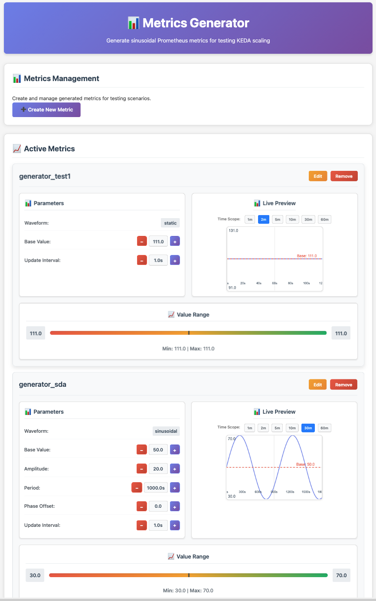

# Metrics Generator

A Python application that generates Prometheus metrics for testing purposes, supporting multiple waveform types and interactive previews.

This project was created while exploring the internals of the Kubernetes Horizontal Pod Autoscaler and KEDA, to better understand their actual behavior.

The idea is simple: provide a metric generator that can be used as input for these scaling mechanisms to test their responses.



## Features

- 🎯 **Multiple Waveform Types**: Sinusoidal, Square, Triangle, Sawtooth, and Static metrics
- 📊 **Prometheus Integration**: Expose metrics on standard Prometheus endpoint
- 🌐 **Interactive Web Interface**: Easy-to-use web UI with live previews

## Usage

1. Run the application:
   ```docker run -p 8001:8001 -p 9100:9100 prometheus-metrics-generator
   ```

2. Open your browser to `http://localhost:8001`

3. **Create Metrics**:

4. **Access Prometheus metrics** at `http://localhost:9100/metrics`

## Configuration

### Environment Variables

- `PROMETHEUS_PORT`: Port for Prometheus metrics (default: 9100)
- `WEB_PORT`: Port for web interface (default: 8001)

## API Endpoints

- `GET /`: Web interface
- `POST /add_metric`: Add new metric
- `POST /update_metric`: Update existing metric
- `POST /remove_metric`: Remove metric
- `GET /config`: Get current configuration
- `GET /metrics`: Prometheus metrics endpoint

## License

MIT License
